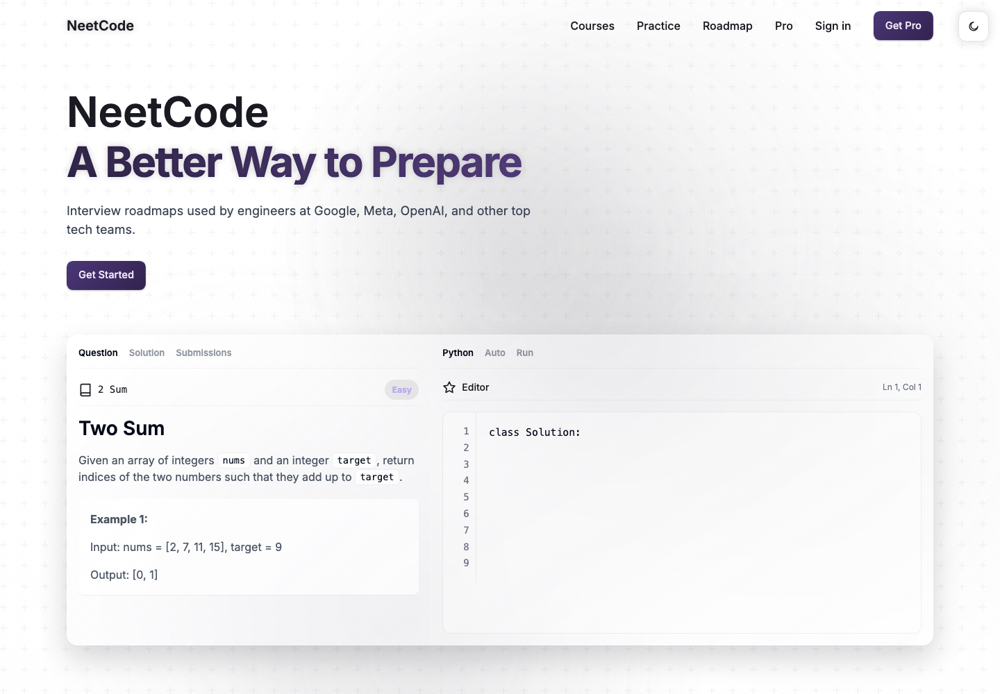
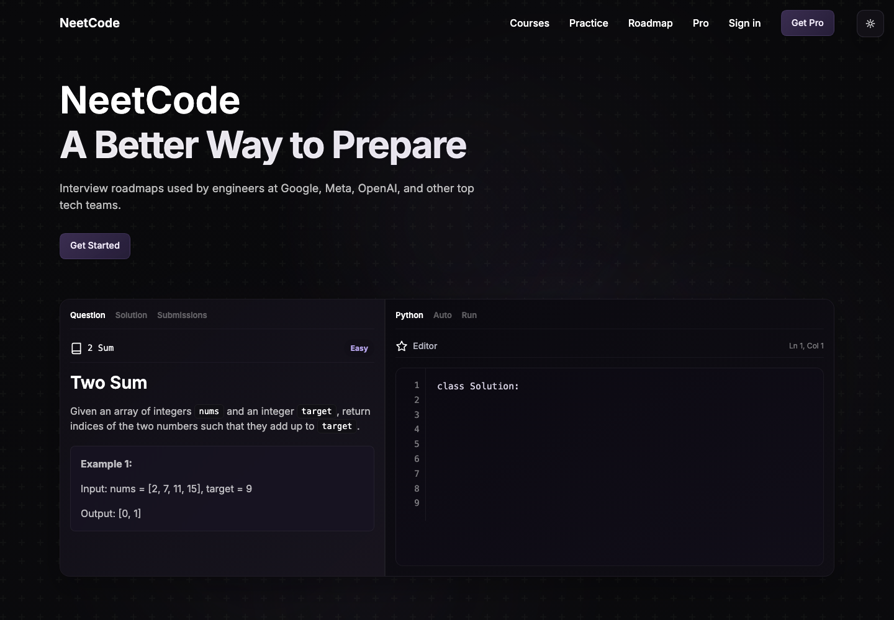

# NeetCode Redesign Static Prototype

This repo is a static redesign concept for NeetCode, focused on making the landing page and coding-practice preview feel more polished, modern, and conversion-oriented.

It packages the redesign as plain HTML, CSS, and JavaScript so the concept can be opened, inspected, and deployed without a framework build step.

## Preview

### Light mode



### Dark mode



## Overview

The prototype reimagines NeetCode as a sharper product landing page: a clear hero message, a realistic coding-workspace preview, top-company social proof, and a GitHub Pages-friendly static implementation.

The goal was not to rebuild the full NeetCode platform. The goal was to show how the first impression, visual hierarchy, and product preview could be redesigned while keeping the page lightweight and easy to ship.

## Stack

- Static HTML
- CSS
- Vanilla JavaScript
- GitHub Pages-friendly deployment

## What I Built

- A redesigned NeetCode-inspired landing page
- A hero section with stronger positioning and CTA structure
- A coding-practice mockup with problem, editor, language, and run controls
- Social-proof/testimonial sections for interview-prep credibility
- A documented visual system in `design-tokens.md`
- A static deployable artifact with no framework dependency

## Project files

- `index.html`: page structure
- `styles.css`: layout, visual design, and responsive styling
- `script.js`: lightweight interactivity
- `assets/`: source imagery and icons
- `design-tokens.md`: color, spacing, typography, and UI token notes
- `docs/assets/`: README screenshots

## Run locally

Because this is a static prototype, you can open `index.html` directly in a browser.

For a local server:

```bash
python3 -m http.server 3000
```

Then open:

```text
http://localhost:3000
```

## Notes for reviewers

- This is a redesign/prototype project, not an official NeetCode product.
- The main signal is frontend execution: visual hierarchy, responsive layout, product framing, and static-site delivery.
- The static implementation makes it easy to review the design without installing dependencies.
